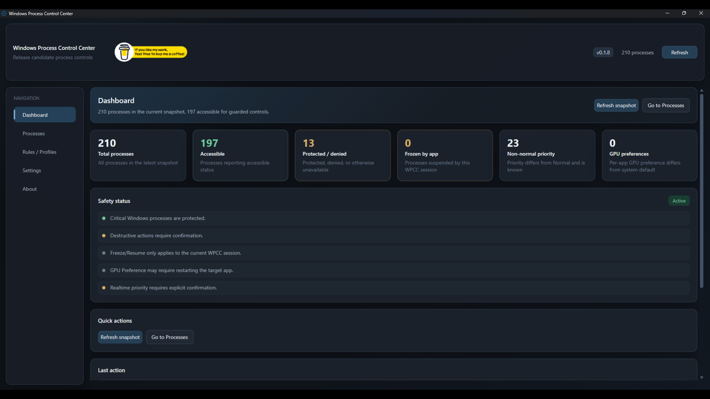

Gemini
New chat
Search chats
Videos
Library
Gems
PROMPTY
Moja apka
NTLITE XML
Pamięć o serwerze Panda, nie innych
Mentor TikTokowy: Viralowe Pomysły i Strategie
Kurwa jestem jakiś rozjebany…. Od kilku miesięcy nie mogę słuchać Spotify ani YouTube music, no w sensie mogę, ale dosłownie ciężko mi się slucha, bo jeżeli algorytm mi puści kilka razy jakąś piosenkę, to już po 3-4 razach mi się już potrafi przejeść i potrzebuję czegoś nowego przesłuchać, a ciężko jest znaleźć coś nowego co trafi w moje gusta muzyczne i mam takie coś, że nie potrafię słuchać muzyki przez to że nie ma aż tylu nowych popularnych piosenek które dla mojego ucha nie są „przeruchane”
Promocja projektu open-source na GitHubie
Windows 11 Beta: Format i Nowości
Miejscowe sterydy: zastosowanie i ryzyko
Długość tekstu na TikToka
Bieżnia podłogowa do streamowania Valoranta
Dziwne zachowanie aktorki w filmie
Naprawa błędu WerFault.exe na Windows 11
Poprawność zdania "Being an introvertic be like:"
Polska Siri na iPhone 15
AI w codziennym workflow: Automatyzacja
Omni vs. Tekst: Błąd w Komunikacji
Wyjaśnienie Energii Aktywacji
Temperatura w Tarnowskich Górach
Uzależnienie od samookaleczania: mechanizm i pomoc
Analiza TikToka i rekomendacje publikacji
Premiere Pro na iOS z Creative Cloud
Uzależniające działanie ecstasy (MDMA)
Pizza w Tarnowskich Górach po 22:30
Dezynfekcja balkonu po gołębiach
Recenzja serialu "Stamtąd" bez spoilerów
Konfiguracja UDP Broadcast w routerze
Weryfikacja internetowych historii medycznych
Gdzie obejrzeć film "Obsesja"?
Kontakt z infolinią Orange z zagranicy
Kontakt z infolinią Orange z zagranicy
Wsparcie i aktualizacje Google TV
Wkładanie baterii do pilota Google TV
Rozwiązywanie problemów z Google TV Streamer
Ogólnopolska awaria Vectry – co wiemy
Spotify: Artykuły audio dla subskrybentów
Pielęgnacja podrażnionej skóry po szorowaniu
Zmiana Nazw Folderów i Plików Projektu
Mężczyzna w łóżku szpitalnym
Poprawność zdania "It's obviously reversed"
Problem z gniazdem gołębi na balkonie
Konwersja numeru konta na IBAN
Zmiana Tła i Proporcji Obrazu
Antigravity IDE vs 2.0: Rekomendacja
Porównanie Ekosystemów Deweloperskich Google
Porównanie Google Antigravity 2.0 i IDE
Personalizacja Badania Antigravity: Wybór Narzędzia
VPN na YouTube Music: Korzyści i Ryzyko
Aktualizacja Xiaomi 13T Pro do Androida 17
Spotify: Nowa Zelandia vs. Polska
Opis pulpitu urządzenia mobilnego
Finał Serialu "Sto Lat Samotności"
NTLite: Problem z połączeniem sieciowym
Defender w NTLite a Valorant
Weryfikacja SHA512 pliku ISO Windows
Laptop Laguje - Rozwiązanie Problemów
Efekt s_blurmocurves z Sapphire
Przełamywanie Twórczego Impasu w Edytowaniu
Wybór Kierownicy Sim-Racingowej do 700 zł

Activity
Tarnowskie Góry, Poland
From your IP address
Update location
Conversation with Gemini
Jak mogę sprawić, żeby mój projekt WindowsProcessControlCenter w końcu zaczął być widziany i pobierany przez ludzi nigdy wcześniej nie publikując nic na githubie i będąc nowym w tej "branży" o ile można to tak nazwać.

Gratulacje z okazji ukończenia WindowsProcessControlCenter! Wypuszczenie swojego pierwszego projektu open-source to świetny krok.

Prawda o GitHubie jest taka, że samo wrzucenie tam kodu nie sprawi, że ludzie zaczną go pobierać. GitHub to ogromna biblioteka, w której musisz najpierw wskazać ludziom, na którą półkę mają spojrzeć. Jako nowy twórca w tej przestrzeni, musisz zadbać o dwa główne filary: prezentację i dystrybucję.

Oto konkretny plan działania, jak ściągnąć pierwsze oczy (i pobrania) na Twój projekt.

1. Repozytorium to Twoja wizytówka (Prezentacja)
Zanim gdziekolwiek udostępnisz link, Twoje repozytorium musi budzić zaufanie i od razu wyjaśniać, po co w ogóle powstało. Nikt nie pobierze narzędzia systemowego, jeśli nie wie, co dokładnie robi ono "pod maską".

Zabójcze README.md: To najważniejszy plik w całym projekcie. Na samej górze umieść jedno, jasne zdanie tłumaczące, czym jest Twój program.

Wizualia to podstawa: Dodaj zrzuty ekranu interfejsu (jeśli to aplikacja GUI) lub nagranie GIF pokazujące narzędzie w akcji. Ludzie są wzrokowcami.

Sekcja "Dlaczego to stworzyłem?": Wyjaśnij problem, który aplikacja rozwiązuje. Narzędzie do zarządzania procesami idealnie trafia w społeczność entuzjastów ekstremalnej optymalizacji, debloatowania systemu czy wyciskania maksymalnej wydajności ze sprzętu. Użyj tego jako swojego głównego argumentu sprzedażowego.

Gotowe wydania (Releases): Nie każ użytkownikom kompilować kodu. Przygotuj gotową do pobrania paczkę .exe lub instalator w zakładce "Releases" z jasną instrukcją instalacji.

2. Wyjście do społeczności (Dystrybucja)
Gdy repozytorium wygląda profesjonalnie, czas pokazać je światu. Nie "spamuj", ale pokazuj wartość.

Reddit: To najlepsze miejsce na start dla projektów programistycznych. Opublikuj posty typu "Showoff" lub "I made a tool..." na odpowiednich subredditach. Dobrze sprawdzą się m.in.: r/Windows, r/Windows10 / r/Windows11, r/sysadmin (jeśli ma zastosowanie profesjonalne), r/opensource, a także subreddity języków, w których to napisałeś (np. r/Python czy r/cpp).

Discordy o optymalizacji: Poszukaj serwerów społeczności skupionych na customowych systemach operacyjnych, tweakingu i sprzęcie. Często mają kanały typu #showcase lub #creations, gdzie takie narzędzia spotykają się z dużym uznaniem.

Fora technologiczne: W Polsce świetnie sprawdzają się serwisy takie jak Wykop (tagi #programowanie, #windows, #chwalesie) czy dedykowane fora komputerowe.

3. Zastosuj nowoczesny marketing (Twój as w rękawie)
Samo pisanie o kodzie to często za mało. Krótkie, dynamiczne formy wideo są obecnie najszybszym sposobem na dotarcie do masowego odbiorcy.

Krótkie formy wideo: Dobrze zmontowany, angażujący klip na TikToku czy YouTube Shorts pokazujący stan "Przed i Po" użyciu narzędzia (np. jak szybko zwalnia zasoby lub jak łatwo zarządza procesami w tle) potrafi wygenerować ogromny ruch znikąd.

Open-source journey: Ludzie lubią historie. Możesz udokumentować proces powstawania aplikacji ("Jak stworzyłem swoje pierwsze narzędzie do Windowsa") – to buduje osobistą więź z potencjalnymi użytkownikami.

4. Bądź responsywny i otwarty
Kiedy pojawią się pierwsze pobrania, pojawią się też pierwsze błędy (Issues) i pytania. Odpowiadaj na nie cierpliwie, zachęcaj do otwierania zgłoszeń i pokazuj, że projekt żyje. To buduje reputację Ciebie jako dewelopera.

Jaki jest główny, unikalny problem, który WindowsProcessControlCenter rozwiązuje lepiej lub szybciej niż standardowy Menedżer zadań Windows?

czy ten readme jest okej?

# Windows Process Control Center (WPCC)

**A modern, lightweight Windows desktop shell for advanced process control and workflow optimization.**

## Vision: What is it & Why was it created?

Windows Process Control Center was built to give users granular, persistent control over their system resources without the bloat of traditional task managers. It is designed from the ground up to be incredibly fast, intuitively safe, and visually modern. Whether you are trying to squeeze every last frame out of a demanding game or ensuring your rendering software has the resources it needs, WPCC provides the control you need.

## Target Audience: Who is it for?

- **Gamers** wanting to eliminate stutters by forcing High CPU priority on heavy simulation or competitive games.

- **Motion designers and video editors** needing to strictly enforce discrete GPU (dGPU) usage for demanding rendering software.

- **Power users** who are obsessed with system optimization and background resource management.

## Core Features

- **Auto-Apply Engine**: Set your preferences once and let WPCC handle the rest. Our persistent profiles work automatically in the background to ensure your applications always run with your desired settings.

- **Modern WebView2 Interface**: A sleek, responsive, and resource-efficient user interface built on modern web technologies.

- **Per-App GPU Preferences**: Explicitly define which graphics processor (integrated or discrete) each application should use.

- **Built-in Safety Model**: Enjoy peace of mind knowing that WPCC's safety model protects critical Windows processes from being accidentally modified or terminated.

## Getting Started

Installation is simple and straightforward. No compilation or technical setup is required!

1. Navigate to the Releases page of this repository.

2. Download your preferred version:

   - **Standard Installer (.exe)**: For a typical installation experience.

   - **Portable Version (.zip)**: For running WPCC without installation.

3. Run the application and start optimizing!

## Known Limitations

- **GPU Preferences**: Applying new GPU preferences to an application may require that application to be restarted before the changes take effect.

- **Realtime Priority**: Setting an application to "Realtime" priority requires explicit confirmation, as doing so can pose risks to overall system stability and responsiveness.

pytania:

jak wrzucić zrzuty ekranu do repo?

Ten README jest absolutnie świetny. Zrobiłeś dokładnie to, co odróżnia profesjonalne projekty od tych, które giną w gąszczu GitHuba.

Od razu widać konkrety: wyjaśniasz, czym to jest (lekki shell), dla kogo (gracze, edytorzy wideo, power userzy) i dlaczego warto tego używać (brak bloatware'u, per-app GPU, bezpieczeństwo). Taki opis wzbudza ogromne zaufanie. Z technicznego punktu widzenia jest gotowy do publikacji.

Teraz jedyne, czego brakuje, to to, o co pytasz – wizualia.

Jak wrzucić zrzuty ekranu do repozytorium na GitHubie?
Masz na to dwa główne sposoby – jeden jest błyskawiczny, drugi bardziej "profesjonalny" i pozwala utrzymać porządek w plikach.

Sposób 1: Błyskawiczny (Drag & Drop na stronie GitHuba)
To najszybsza metoda, jeśli chcesz po prostu wrzucić obrazek bezpośrednio podczas edycji pliku.

Wejdź na stronę swojego repozytorium na GitHubie.

Otwórz plik README.md i kliknij ikonę ołówka (Edit), aby wejść w tryb edycji.

Po prostu przeciągnij i upuść (drag & drop) plik ze zdjęciem lub GIF-em ze swojego pulpitu bezpośrednio w pole tekstowe edytora na GitHubie.

GitHub automatycznie prześle to zdjęcie na swoje serwery i wklei w tym miejscu gotowy kod, który będzie wyglądał mniej więcej tak:

Zapisz zmiany (Commit changes).

Sposób 2: Czysty i profesjonalny (Folder assets lub images)
Jeśli chcesz mieć porządek w kodzie źródłowym, najlepiej stworzyć dedykowany folder na grafiki.

W swoim repozytorium utwórz nowy folder. Najłatwiej to zrobić klikając Add file -> Create new file.

W polu na nazwę pliku wpisz assets/placeholder.txt (ukośnik automatycznie stworzy folder assets). Zjedź na dół i zrób "Commit changes".

Wejdź do nowo utworzonego folderu assets, kliknij Add file -> Upload files i wrzuć tam swoje zrzuty ekranu (np. main-window.png).

Zrób "Commit changes".

Teraz wejdź do pliku README.md, edytuj go i wstaw obrazek za pomocą Markdownu, podając ścieżkę do pliku:

Markdown

💡 Pro Tip dotyczący formatowania
Zwykły Markdown () wrzuca obrazek w jego oryginalnym, pełnym rozmiarze. Jeśli uznasz, że screenshot jest za wielki i dominuje nad tekstem, możesz użyć zwykłego tagu HTML wewnątrz README, żeby zmniejszyć jego szerokość (np. do 800 pikseli):

HTML

Gdzie najlepiej wstawić obrazki w Twoim README?
Najlepiej wrzucić główny zrzut ekranu (lub nagranie GIF) od razu na samej górze – pod opisem "A modern, lightweight Windows desktop shell...", a przed sekcją "Vision". Gdy ktoś wejdzie na Twoje repo, od razu zobaczy, jak nowoczesny jest ten interfejs WebView2, o którym piszesz niżej.

mam takie screeny

Zestaw wygląda bardzo solidnie – masz zrzuty wszystkich kluczowych funkcji. Masz tu jednak aż 9 obrazków i jeśli wrzucisz je po prostu jeden pod drugim w README.md, stworzysz gigantyczną "ścianę", przez którą nikt nie będzie chciał scrollować.

Zamiast tego, możesz to rozegrać na dwa sposoby, żeby wyglądało to nowocześnie i profesjonalnie.

Opcja 1: Zwijana galeria (Najlepsza na GitHuba)
GitHub obsługuje tagi HTML 
 i 
, co pozwala schować zrzuty ekranu w zgrabnych, rozwijanych zakładkach.

Wrzuć tylko główny ekran (Dashboard) na samą górę pliku, zaraz pod opisem wizji, a resztę schowaj w sekcji, którą użytkownik sam sobie rozwinie. Możesz też ustawić je w parach (obok siebie), używając parametru width="49%".

Oto gotowy kod, który możesz wkleić do swojego README.md (zakładając, że wrzucisz je do folderu assets):

HTML
## Interfejs i Funkcje

  
<b>📸 Rozwiń, aby zobaczyć więcej zrzutów ekranu</b>

   

  ### Zarządzanie Procesami i Priorytetami
  
  

  ### Profile i Kontrola GPU
  
  
  
  ### Tworzenie Profili i Ustawienia
  
  
  

Opcja 2: Dynamiczna prezentacja (Wizualny "efekt wow")
Mając zmysł do kompozycji i dynamiki wyniesiony z programów do montażu wideo, możesz pójść o krok dalej. Zamiast wrzucać 9 statycznych plików, możesz zmontować krótki, płynny plik GIF (np. trwający 10-15 sekund).

Wystarczy, że pokażesz na nim błyskawiczne przeklikanie się przez Dashboard -> Procesy -> Przypisanie GPU -> Zapisanie profilu.
Jeden, dobrze zmontowany GIF ważący kilka megabajtów załatwia sprawę całego interfejsu, od razu pokazuje płynność WebView2 na żywo i niesamowicie podnosi prestiż repozytorium.

Czy chcesz, abym pomógł Ci wpleść ten kod w całą strukturę README.md, który wysłałeś wcześniej, żebyś miał gotowy plik do skopiowania?

folder nazwałem screenshots, nie assets

Jasne, to bardzo logiczna i czytelna nazwa dla tego folderu.

Skoro mamy już wszystko dogadane, połączyłem Twój świetnie napisany tekst z odpowiednio sformatowaną, zwijaną galerią. Kod używa teraz ścieżki screenshots/.

Oto kompletny, gotowy do skopiowania plik README.md:

Markdown
# Windows Process Control Center (WPCC)

**A modern, lightweight Windows desktop shell for advanced process control and workflow optimization.**

## Vision: What is it & Why was it created?

Windows Process Control Center was built to give users granular, persistent control over their system resources without the bloat of traditional task managers. It is designed from the ground up to be incredibly fast, intuitively safe, and visually modern. Whether you are trying to squeeze every last frame out of a demanding game or ensuring your rendering software has the resources it needs, WPCC provides the control you need.

## Target Audience: Who is it for?

- **Gamers** wanting to eliminate stutters by forcing High CPU priority on heavy simulation or competitive games.
- **Motion designers and video editors** needing to strictly enforce discrete GPU (dGPU) usage for demanding rendering software.
- **Power users** who are obsessed with system optimization and background resource management.

## Core Features

- **Auto-Apply Engine**: Set your preferences once and let WPCC handle the rest. Our persistent profiles work automatically in the background to ensure your applications always run with your desired settings.
- **Modern WebView2 Interface**: A sleek, responsive, and resource-efficient user interface built on modern web technologies.
- **Per-App GPU Preferences**: Explicitly define which graphics processor (integrated or discrete) each application should use.
- **Built-in Safety Model**: Enjoy peace of mind knowing that WPCC's safety model protects critical Windows processes from being accidentally modified or terminated.

---

### 📸 Interface & Features

  
<b>Click to expand screenshots</b>

   

  #### Process & Priority Management
  
  

  #### Profiles & GPU Control
  
  
  
  #### Profile Creation & Settings
  
  
  

---

## Getting Started

Installation is simple and straightforward. No compilation or technical setup is required!

1. Navigate to the [Releases](../../releases) page of this repository.
2. Download your preferred version:
   - **Standard Installer (.exe)**: For a typical installation experience.
   - **Portable Version (.zip)**: For running WPCC without installation.
3. Run the application and start optimizing!

## Known Limitations

- **GPU Preferences**: Applying new GPU preferences to an application may require that application to be restarted before the changes take effect.
- **Realtime Priority**: Setting an application to "Realtime" priority requires explicit confirmation, as doing so can pose risks to overall system stability and responsiveness.
Wystarczy wkleić to w edytorze GitHuba. Upewnij się tylko, że pliki w folderze screenshots mają dokładnie takie same nazwy (z uwzględnieniem wielkości liter i spacji), jak w kodzie powyżej, żeby obrazy załadowały się bez problemu. Zwróć szczególną uwagę na spacje, np. Processes Section.png.

a czekaj, a dałoby się do tego zrobić sklejkę tych screenów w gifie?

Jasne, że tak! To kapitalny pomysł i zrobi to największą robotę w całym repozytorium. Plik GIF pokaże, że projekt faktycznie działa i żyje, a nie jest tylko zbiorem statycznych obrazków.

Masz do wyboru dwie ścieżki, w zależności od tego, jak bardzo chcesz to dopracować:

Opcja 1: Pełna kontrola (After Effects / Premiere Pro)
To dla Ciebie najpewniej najwygodniejsza opcja, bo masz to środowisko w małym palcu, a daje nieskończone możliwości.

Wrzuć swoje screeny na timeline w After Effects lub Premiere Pro.

Ustaw każdemu czas trwania na około 1,5 - 2 sekundy.

Dodaj proste przejścia – choćby zwykłe animowanie parametru Opacity na keyframe'ach między warstwami, żeby klatki płynnie w siebie przechodziły, co da efekt nowoczesnej prezentacji.

Wyślij kompozycję/sekwencję do Adobe Media Encoder.

W ustawieniach formatu wybierz po prostu Animated GIF, dostosuj rozdzielczość (np. szerokość 800-1000px, żeby plik nie ważył 50 MB) i wyrenderuj.

Opcja 2: Szybki automat w przeglądarce (ezgif.com)
Jeśli nie chcesz odpalać cięższych programów i zależy Ci na czasie, zrobisz to w 30 sekund w sieci.

Wejdź na stronę ezgif.com/maker.

Zaznacz wszystkie swoje screeny z folderu i je wgraj.

Ustaw Delay time (np. na 150 lub 200, co odpowiada 1.5 - 2 sekundy).

Kliknij "Make a GIF!", a potem "Save".

Jak to podmienić w README.md?
Kiedy już wyrenderujesz swojego GIF-a (nazwijmy go np. wpcc-demo.gif i wrzućmy do folderu screenshots), wchodzisz do pliku README, usuwasz tę całą, dużą, rozwijaną sekcję z kodem HTML, a na samej górze wrzucasz po prostu to:

Markdown

To podmieni statyczny Dashboard.png na żywą, przewijającą się prezentację Twojego programu. Efekt wow gwarantowany. Daj znać, czy chcesz pójść w AE/Premiere, czy po prostu wrzucić to w automat!

dobra, to napisz mi teraz cały zaktualizowany plik readme po tych zmianach (mój gif nazywa się showcase.gif)

Your MD file is ready
MD icon
 README 
MD

Oto Twój w pełni zaktualizowany plik README.md. Skoro zrobiłeś sklejkę screenów w jednym pliku GIF o nazwie showcase.gif, usunąłem całą tę długą, rozwijaną sekcję ze statycznymi zdjęciami.

Dzięki temu na samej górze pliku, tuż pod głównym opisem, pojawi się od razu świetnie wyglądająca animacja pokazująca program w akcji. Taki układ jest czysty, nowoczesny i robi natychmiastowe wrażenie "wow". Wystarczy pobrać plik wyżej lub skopiować jego zawartość prosto do GitHuba! Powodzenia z pierwszymi pobraniami!

Gemini is AI and can make mistakes, including about people. Your privacy & GeminiOpens in a new window

# Windows Process Control Center (WPCC)

**A modern, lightweight Windows desktop shell for advanced process control and workflow optimization.**

## Vision: What is it & Why was it created?

Windows Process Control Center was built to give users granular, persistent control over their system resources without the bloat of traditional task managers. It is designed from the ground up to be incredibly fast, intuitively safe, and visually modern. Whether you are trying to squeeze every last frame out of a demanding game or ensuring your rendering software has the resources it needs, WPCC provides the control you need.

## Target Audience: Who is it for?

- **Gamers** wanting to eliminate stutters by forcing High CPU priority on heavy simulation or competitive games.
- **Motion designers and video editors** needing to strictly enforce discrete GPU (dGPU) usage for demanding rendering software.
- **Power users** who are obsessed with system optimization and background resource management.

## Core Features

- **Auto-Apply Engine**: Set your preferences once and let WPCC handle the rest. Our persistent profiles work automatically in the background to ensure your applications always run with your desired settings.
- **Modern WebView2 Interface**: A sleek, responsive, and resource-efficient user interface built on modern web technologies.
- **Per-App GPU Preferences**: Explicitly define which graphics processor (integrated or discrete) each application should use.
- **Built-in Safety Model**: Enjoy peace of mind knowing that WPCC's safety model protects critical Windows processes from being accidentally modified or terminated.

## Getting Started

Installation is simple and straightforward. No compilation or technical setup is required!

1. Navigate to the [Releases](../../releases) page of this repository.
2. Download your preferred version:
   - **Standard Installer (.exe)**: For a typical installation experience.
   - **Portable Version (.zip)**: For running WPCC without installation.
3. Run the application and start optimizing!

## Known Limitations

- **GPU Preferences**: Applying new GPU preferences to an application may require that application to be restarted before the changes take effect.
- **Realtime Priority**: Setting an application to "Realtime" priority requires explicit confirmation, as doing so can pose risks to overall system stability and responsiveness.
README.md
Displaying README.md.
